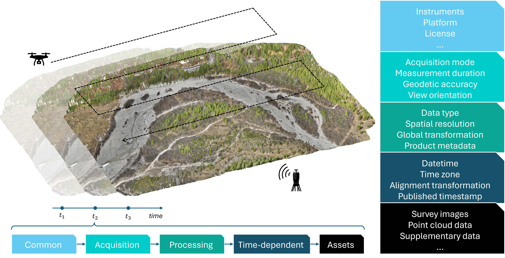
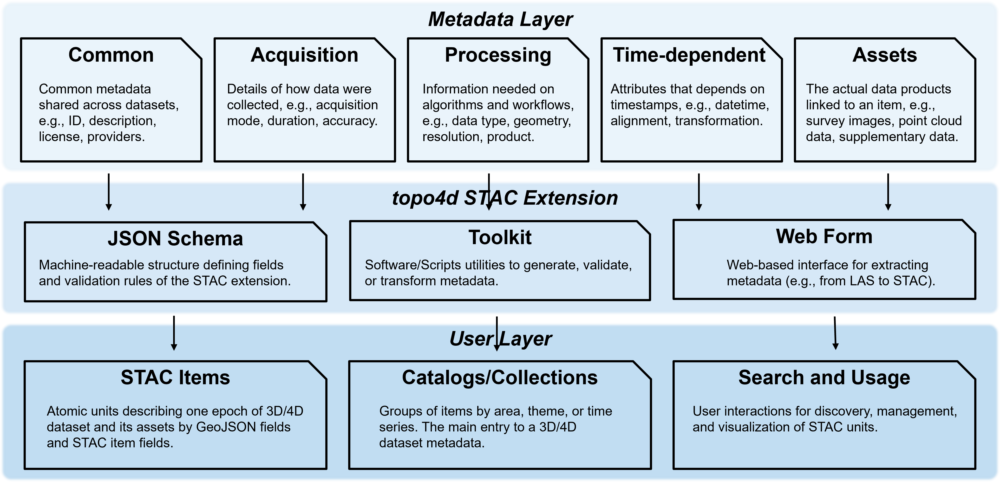

# 4D-WORKS Guide: Towards Automatic Metadata Curation for 4D Topographic Observation

4D topographic data, i.e. dense 3D time series, have become increasingly available through near-continuous in-situ observation using, e.g., laser scanning or photogrammetry, to capture Earth surface dynamics across time (Lindenbergh et al., 2025[^Lindenbergh2025]). Unlike traditional multitemporal datasets with only a few repeat point cloud acquisitions, the time series consist of a high number of epochs (typically hundreds to thousands; e.g., Vos et al. 2021[^Vos2021], Anders et al. 2022[^Anders2022]) and create a great challenge for consistent metadata handling due to a lack of established practices regarding time-dependent metadata. Essential processing information and products, such as transformation matrices required for time-dependent alignment of epochs, has not yet been handled in a consistent manner and usually provided as supplementary files in formats tailored to the user-specific tools that were used for the processing. Reusing the data in different workflows and domains can thus be tedious, as they often require customized scripts to read the large volumes of 4D (3D+time) data. Especially with emerging efforts of research groups to publish such valuable datasets, the development of uniform and flexible metadata practices is a timely effort to establish a cross-community practice.

The aim of our 4D-WORKS metadata practice is to improve interoperability, simplify reuse across Research Data Management (RDM) workflows by the Earth System Science (ESS) community, and encourage increasing 4D dataset publication by reducing preparation effort. To address this, we propose a metadata schema and automated curation workflow tailored to time-dependent topographic datasets, with a special focus on near-continuous time series and multi-source data. The approach is demonstrated for different use cases and application scenarios, integrating various data sources (in-situ laser scanning and photogrammetry, satellite imagery) and processing products to foster community adoption and practical applicability. [TODO: state explicitly here the STAC extension? as this is a guide and not proposal]

[TODO can we integrate a more holistic view here, incorporating also other references (photogrammetry time series, spatiotemporal satellite topo time series, ...)]

## Guide Overview

This documentation summarises how to ingest, construct, and search a STAC-based metadata framework using the topo4d extension for topographic 3D time series data. It consists of the following components:

- [Guide](guide_overview.md) outlines the metadata ingestion, construction, and usage workflow.
- [Topo4D Extension API](../api/topo4d-extension.md) provides the STAC extension fields and validation helpers.
- [Builder API](../api/builder.md) provides helpers for making STAC Items using other community open-source tools, e.g., laspy, PDAL, etc.
- [Notebook: make_STAC_kijkduin](../notebooks/make_STAC_kijkduin.ipynb) is an example notebook building a STAC catalog from near-continuous terrestrial laser scanning point clouds.
- [Notebook: make_STAC_Isar](../notebooks/make_STAC_Isar.ipynb) is an example notebook building a STAC catalog from multi-temporal multi-source in-situ point clouds and satellite imagery, including relevant change analysis products. [TODO is the satellite imagery integrated here? and the TLS (not mentioned yet)?]
- [Notebook: demo_stac_kijkduin](../notebooks/demo_stac_kijkduin.ipynb) is an example notebook showcasing the usage of STAC catalog with change analysis tools, here, py4dgeo.

## Introduction

*Different types of metadata (Common - Acquisition - Processing - Time-dependent - Assets) generated during the classical topographic change analysis workflow. (Figure by Wang et al.[^Wang2026]).*

Topographic 4D data provide dense 3D time series that capture surface change across many epochs. These datasets are valuable for understanding natural processes, infrastructure monitoring, or hazard assessment. However, their reuse and publication are often limited by heterogeneous or incomplete metadata.

Metadata describes the who, what, when, where, why, and how of a geographic dataset, thus ensuring that others can understand, reproduce, and integrate the datasets. As shown in the figure above, metadata in 4D topographic observations can be grouped into five categories[^Wang2026]:

- Common metadata: General information such as instruments, platforms, or licenses. Example: sensor type (e.g., UAV with RGB camera) or data license (e.g., Creative Commons).

- Acquisition metadata: Details of how the data were acquired, including acquisition mode, duration, positional accuracy, or view orientation. Example: RTK GNSS accuracy in centimeters, flight path of an oblique UAV survey.

- Processing metadata: Information on data handling, such as spatial resolution, global transformation, or product description. Example: transformation matrices, point density, or classification scheme.

- Time dependent metadata: Attributes that change with each epoch, including timestamp, time zone, or alignment transformations. Example: acquisition datetime in UTC or per-epoch alignment files.

- Assets metadata: Links to the actual data products such as survey images, point clouds, or supplementary data.

Currently, these metadata are stored in diverse formats, often tailored to specific software. Common formats include text files (TXT, CSV), XML or JSON files, specialized geospatial formats (GeoTIFF, LAS/LAZ) and proprietary formats from photogrammetry or laser scanning software. Without a uniform structure, reusing the datasets across workflows requires custom scripts and extensive manual effort.

Establishing a consistent metadata framework is therefore crucial to ensure interoperability and reproducibility as well as lowering the barrier for publishing and reusing datasets, thus increasing their scientific and practical value.

## Prerequisites

Before using the Topo4D metadata curation framework, some basic knowledge and tools are required. Users should be familiar with point cloud data formats (e.g., LAS/LAZ), common metadata standards, and the SpatioTemporal Asset Catalog ([STAC](https://stacspec.org/en/tutorials/intro-to-stac/)). 
A Python environment with the provided toolkit [topo4D Extension API](../api/topo4d-extension.md), as well as access to representative survey data [demo data TODO]() from laser scanning or photogrammetry, is recommended.

## Metadata Curation Workflow

*Three-layer architecture of the Topo4D STAC extension for 3D/4D topographic metadata curation. (Figure by Wang et al.[^Wang2026])*

Our system for 4D topographic metadata curation is structured into three layers.

- Metadata Layer: Defines five categories of metadata: common (general dataset information), acquisition (survey details), processing (workflow and algorithms), time dependent (epoch-specific attributes), and assets (linked data products).

- Topo4D STAC Extension: Provides the technical framework with a JSON schema for machine readability, toolkits for generating and validating metadata, and a web form for extracting metadata directly from raw data such as LAS files.

- User Layer: Organizes the curated metadata into STAC items and catalogs for 3D and 4D datasets, enabling efficient search, discovery, and reuse across domains.

This architecture ensures metadata are consistent, interoperable, and directly usable by both researchers and applications, lowering the barrier for sharing and reusing 4D datasets.
[TODO: somehow ending abruptly here - where does the user go next? what is the end/next entry point?]

# References

[^Vos2021]: S. Vos, K. Anders, M. Kuschnerus, R. Lindenbergh, B. Höfle, S. Aarninkhof, S. de Vries, "A high-resolution 4D terrestrial laser scan dataset of the Kijkduin beach-dune system, The Netherlands," Sci Data 9, 191, Apr. 2022, doi:https://doi.org/10.1038/s41597-022-01291-9.
[^Anders2022]: K. Anders, L. Winiwarter and B. Höfle, "Improving Change Analysis From Near-Continuous 3D Time Series by Considering Full Temporal Information," in IEEE Geoscience and Remote Sensing Letters, vol. 19, pp. 1-5, 2022, Art no. 3511105, doi: https://doi.org/10.1109/LGRS.2022.3148920.
[^Lindenbergh2025]: Lindenbergh, R., Anders, K., Campos, M., Czerwonka-Schröder, D., Höfle, B., Kuschnerus, M., ... & Vos, S. (2025). Permanent terrestrial laser scanning for near-continuous environmental observations: Systems, methods, challenges and applications. ISPRS Open Journal of Photogrammetry and Remote Sensing, 100094, doi:https://doi.org/10.1016/j.ophoto.2025.100094.
[^Wang2026]: J. Wang, X. Huang, P. Maydhisudhiwongs, M. Letard, B. Teuscher, M. Werner, K. Anders, "topo4d: Topographic 4D STAC Extension for Curating and Cataloging Multi-Source Geospatial Time Series Datasets," in review.
