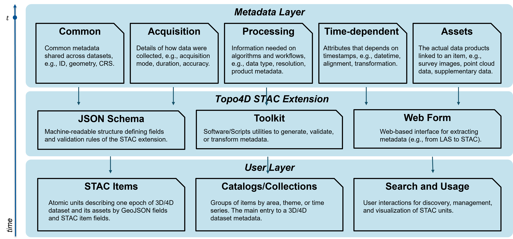

# A Roadmap Towards Automatic Metadata Curation for 4D Topographic Observations

4D topographic observations, i.e. dense 3D time series, are acquired using laser scanning or photogrammetry to assess changes in a scene throughout different points in time. Unlike traditional multitemporal datasets with only a few repeat point cloud acquisitions, the time series consist of a high number of epochs (typically hundreds to thousands; e.g., Vos et al. 2021, Anders et al. 2023) create a great challenge for consistent metadata handling. Especially, there is no standard or established practice regarding time-dependent metadata, starting from the timestamp of acquisitions. Essential processing information and products, such as transformation matrices required for time-dependent alignment of epochs, is not handled in a consistent manner and usually provided as supplementary files in formats tailored to the user-specific tools that were used for the processing. Reusing the data in different workflows and domains is tedious, as they often require customized scripts to handle the large volumes of 4D (3D+time) data. Especially with emerging efforts of research groups to publish such valuable datasets, the development of uniform and flexible metadata.

A standardized metadata practice would greatly improve interoperability, simplify reuse across RDM workflows by the ESS community, and encourage more 4D dataset publication by reducing preparation effort. To address this, we propose a metadata schema and automated curation workflow tailored to time-dependent point cloud data. The approach is demonstrated with use cases in laser scanning, photogrammetry and processing products to ensure community adoption and practical applicability.

## Introduction

*Different types (Common - Acquisition - Processing - Time-dependent - Assets) of metadata generated during the classical topographic change analysis workflow. Figure by J.Wang.*

Topographic 4D data, often derived from repeated laser scanning or photogrammetry surveys, provide dense 3D time series that capture surface change across many epochs. These datasets are valuable for understanding natural processes, infrastructure monitoring, or hazard assessment. However, their reuse and publication are often limited by missing or inconsistent metadata.

Metadata is data about data. It describes the who, what, when, where, why, and how of a geographic dataset. It ensures that others can understand, reproduce, and integrate the datasets. As shown in the figure, metadata in 4D topographic observations can be grouped into five categories:

- Common metadata: General information such as instruments, platforms, or licenses. Example: sensor type (e.g., UAV with RGB camera) or data license (e.g., Creative Commons).

- Acquisition metadata: Details of how the data were acquired, including acquisition mode, duration, positional accuracy, or view orientation. Example: RTK GNSS accuracy in centimeters, flight path of an oblique UAV survey.

- Processing metadata: Information on data handling, such as spatial resolution, global transformation, or product description. Example: transformation matrices, point density, or classification scheme.

- Time dependent metadata: Attributes that change with each epoch, including timestamp, time zone, or alignment transformations. Example: acquisition datetime in UTC or per-epoch alignment files.

- Assets metadata: Links to the actual data products such as survey images, point clouds, or supplementary data.

Currently, these metadata are stored in diverse formats, often tailored to specific software. Common formats include text files (TXT, CSV), XML or JSON sidecar files, and proprietary project formats from photogrammetry or laser scanning software. Without a uniform structure, reusing the datasets across workflows requires custom scripts and extensive manual effort.

Establishing a consistent metadata framework is therefore crucial. It not only ensures interoperability and reproducibility but also lowers the barrier for publishing datasets, increasing their scientific and practical value.

## Prerequisites

Before using the Topo4D metadata curation system, some basic knowledge and tools are required. Users should be familiar with point cloud data formats (e.g., LAS/LAZ), common metadata standards, and the SpatioTemporal Asset Catalog (STAC) framework. A Python environment with the provided toolkit, as well as access to representative survey data from laser scanning or photogrammetry, is recommended.

## Metadata Curation Workflow

*Three-layer architecture of the Topo4D STAC extension for 3D/4D topographic metadata curation. Figure by J.Wang*

Our system for 4D topographic metadata curation is structured into three layers.

- Metadata Layer: Defines five categories of metadata: common (general dataset information), acquisition (survey details), processing (workflow and algorithms), time dependent (epoch-specific attributes), and assets (linked data products).

- Topo4D STAC Extension: Provides the technical framework with a JSON schema for machine readability, toolkits for generating and validating metadata, and a web form for extracting metadata directly from raw data such as LAS files.

- User Layer: Organizes the curated metadata into STAC items and catalogs for 3D and 4D datasets, enabling efficient search, discovery, and reuse across domains.

This architecture ensures metadata are consistent, interoperable, and directly usable by both researchers and applications, lowering the barrier for sharing and reusing 4D datasets.

<!-- ### Metadata Ingestion

### Metadata Construction

### Metadata Usage
 -->

<!-- ## Use Cases and Data

Multi-sensor multi-temporal UAV acquisition and processing products

High-frequency terrestrial laser scanning (TLS) point clouds -->

## References

- S. Vos, K. Anders, M. Kuschnerus, R. Lindenbergh, B. Höfle, S. Aarninkhof, S. de Vries, “A high-resolution 4D terrestrial laser scan dataset of the Kijkduin beach-dune system, The Netherlands,” Sci Data 9, 191, Apr. 2022, doi: https://doi.org/10.1038/s41597-022-01291-9.
- STAC SpatioTemporal Asset Catalogs. https://stacspec.org/en/