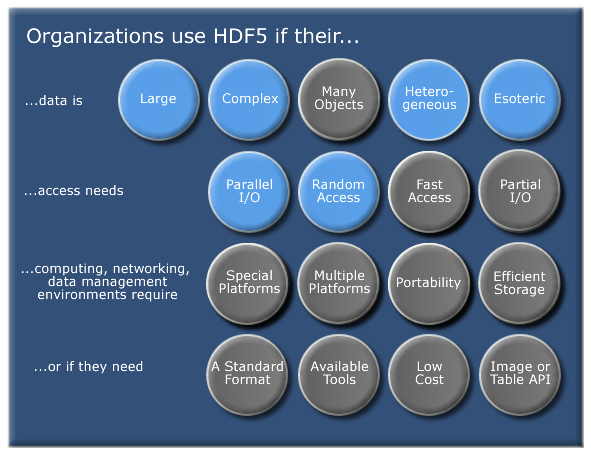

# 4D-Works project roadmap

## Related work: existing metadata practices in published literature and software
[here we insert our notes, illustrations, etc as mentioned in the kickoff. Illustrations to be kept in the final version should be in the assets folder too.]

### Concepts of Metadata

Metadata is "data that provides information about other data", but not the content of the data itself.

<!-- ref: https://en.wikipedia.org/wiki/Metadata -->

#### Types of Metadata

<!-- ref:
- https://en.wikipedia.org/wiki/Metadata
- Zenodo metadata
- https://guides.library.ubc.ca/c.php?g=677995&p=5270026
- https://hevoacademy.com/metadata-management/types-of-metadata/
- https://metadataetc.org/metadatabasics/types.htm -->

The metadata typically include three major types: descriptive metadata, structural metadata, and administrative metadata. There are also many additional types of metadata commonly used in different disciplines, including:

| Type                     | Purpose                                                                                                   | Example                                                          |
| ------------------------ | --------------------------------------------------------------------------------------------------------- | ---------------------------------------------------------------- |
| Descriptive Metadata     | The descriptive information about a resource. It is used for discovery and identification.                | Title, abstract, author, keywords.                               |
| Structural Metadata      | Defines the organization and relationships within the dataset.                                            | Chapters, sections, headings, timestamps, markers, pointers.     |
| Administrative Metadata  | Provides management details like ownership, access, and retention.                                        | Resource type, and permissions, and when and how it was created. |
| Technical Metadata       | Contains technical specifications such as file format, resolution, and software.                          | Resolution, compression, used software.                          |
| Legal Metadata           | Specifies usage rights, licenses, and restrictions.                                                       | License, copyright, term of use.                                 |
| Provenance Metadata      | This relates to the origins and processing of the data, and enables interpretation and reuse of the data. | Origin, transformations, versioning.                             |
| Preservation Metadata    | Ensures long-term usability and integrity of data.                                                        | File formats, migration strategies, metadata schemas.            |
| Usage Metadata           | Tracks how the dataset is accessed.                                                          | Download count, api requests,                                    |
| Domain-Specific Metadata | Captures domain specialized information.                                            | Spatial extent, temporal coverage, sensor types, statistics.                 |


### Metadata practices in published 4D datasets

#### Near-continuous 3D obsearvations on sandy beach 

##### Kijkduin

- Metadata source
  - Kijkduin_TLS_2016-2017_meta_version_17-2-2022.pdf
  - PANGAEA: https://doi.pangaea.de/10.1594/PANGAEA.934058
  - 4TU.ResearchData: https://data.4tu.nl/articles/_/12692660/1
- Metadata availability

    | Type                     | Metadata                                                            | Format                   |
    | ------------------------ | ------------------------------------------------------------------- | ------------------------ |
    | Descriptive Metadata     | Title, abstract, author, keywords                                   | PDF, web                 |
    | Structural Metadata      | Timestamps, file naming, file overview                              | PDF                      |
    | Administrative Metadata  | Funding, organizations, projects                                    | PDF, web                 |
    | Technical Metadata       | Resolution, software, compression                                   | PDF                      |
    | Legal Metadata           | License                                                             | Web                      |
    | Provenance Metadata      | Processing steps, transformation matrix (Global and time-alignment) | TXT                      |
    | Preservation Metadata    | Scripts for conversions                                             | TXT, `.py`, `.m`, `.las` |
    | Usage Metadata           | Views, citations, downloads                                         | Web                      |
    | Domain-Specific Metadata | Spatial and temporal coverage, geolocation, auxiliary data          | TXT, web, XLSX           |


- Structural metadata   
  ```
    .
    ├── 01_auxilary/
    │   ├── Documentation/
    │   │   ├── DataSheet_VZ-2000_2017-06-07.pdf
    │   │   ├── Whitepaper_LASextrabytes_implementation_in-RIEGLSoftware_2017-12-04.pdf
    │   │   └── Kijkduin_TLS_2016-2017_meta_version_17-2-2022.pdf
    │   ├── scripts/
    │   │   ├── Kijkduin_Global_Transformation.txt
    │   │   ├── lasheader.las
    │   │   ├── LASread.m
    │   │   ├── LASwrite.m
    │   │   ├── laszip-cli.linux.txt
    │   │   ├── laszip-cli.windows.txt
    │   │   ├── pointcloud_processing_functions.m
    │   │   └── pointcloud_processing_functions.py
    │   ├── Auxiliary_data/
    │   │   ├── align_plains_kijkduin_lcs.txt
    │   │   ├── KIJKDUIN_reference_measurements_19-2-2017(RDNAP-version 2008).txt
    │   │   ├── KIJKDUIN_reference_measurements_24-2-2017(RDNAP-version 2008).txt
    │   │   ├── Waterlevel_Scheveningen.xlsx
    │   │   ├── Wave-data_Europlatform.xlsx
    │   │   ├── Wave-data_ljmuiden.xlsx
    │   │   └── Weather-data_Hoek_van_Holland.xlsx
    │   └── Global_transformation_matrix/
    │       └── Kijkduin_Global_Transformation.txt
    └── 02_data/
        └── YYMMDD.zip/
            ├── YYMMDD_HHMMSS.laz
            ├── YYMMDD_HHMMSS_incl.txt
            ├── YYMMDD_HHMMSS_meta.txt
            └── YYMMDD_HHMMSS_trafomat.txt
    ```

##### Noordwijk

- Metadata source
  - Noordwijk_PLS_2019-2022_meta.pdf
  - 4TU.ResearchData: https://data.4tu.nl/datasets/1aac46fb-7900-4d4c-a099-d2ce354811d2/2

- Metadata availability
    | Type                     | Metadata                                                            | Format                   |
    | ------------------------ | ------------------------------------------------------------------- | ------------------------ |
    | Descriptive Metadata     | Title, abstract, author, keywords                                   | PDF, web                 |
    | Structural Metadata      | Timestamps, file naming, file overview                              | PDF                      |
    | Administrative Metadata  | Funding, organizations, projects                                    | PDF, web                 |
    | Technical Metadata       | Resolution, software, compression                                   | PDF                      |
    | Legal Metadata           | License                                                             | Web                      |
    | Provenance Metadata      | Processing steps, transformation matrix (Global and time-alignment) | TXT                      |
    | Preservation Metadata    | Scripts for conversions                                             | TXT, `.py`, `.m`, `.las` |
    | Usage Metadata           | Views, citations, downloads                                         | Web                      |
    | Domain-Specific Metadata | Spatial and temporal coverage, geolocation, auxiliary data          | TXT, web, XLSX           |


  
- Structural meatadata
    ```
    .
    ├── DataSheet_VZ-2000_2017-06-07.pdf
    ├── Noordwijk_PLS_2019-2022_meta.pdf
    ├── Whitepaper_LASextrabytes_implementation_in-RIEGLSoftware_2017-12-04.pdf
    ├── scripts/
    │   ├── lasheader.las
    │   ├── LASread.m
    │   ├── LASreadOctave.m
    │   ├── LASwrite.m
    │   ├── laszip-cli.linux.txt
    │   ├── laszip-cli.windows.txt
    │   ├── pointcloud_processing_functions.m
    │   ├── pointcloud_processing_functions.py
    │   └── read_align_point_cloud.py
    └── publication/
        ├── _Global transformation matrix/
        │   ├── Global_transformation_matrix_NW_after_2dec2020.dat
        │   └── Global_transformation_matrix_NW_before_2dec2020.dat
        └── YYMMDD/
            ├── YYMMDD_HHMMSS.laz
            ├── YYMMDD_HHMMSS_incl.asc
            └── YYMMDD_HHMMSS_trafomat.txt
    ```


#### Multi-source 3D obsearvations

##### Pielach River

- Metadata source
  - TUWien re3data: https://researchdata.tuwien.ac.at/records/taz19-r6618
  - Integrated readme.txt
- Metadata availability
  
    | Type                     | Metadata                           | Format   |
    | ------------------------ | ---------------------------------- | -------- |
    | Descriptive Metadata     | Title, abstract, author, keywords  | TXT, web |
    | Structural Metadata      | Structure of subfolders            | TXT      |
    | Administrative Metadata  | Funding, organizations, projects   | TXT, web |
    | Technical Metadata       | Resolution, software, file formats | TXT      |
    | Legal Metadata           | License                            | Web      |
    | Provenance Metadata      | Processing steps                   | TXT      |
    | Preservation Metadata    |                                    |      |
    | Usage Metadata           |                                    |      |
    | Domain-Specific Metadata |                                    |      |


  
- Structural metadata
  ```
    .
    ├── 01_LiDAR_topobathy_raw .............. raw topo-bathymetric 3D LiDAR point clouds (strip-wise, geo-referenced, no refraction correction, LAZ format)
    ├── 02_LiDAR_topo_raw ................... raw topographic 3D LiDAR point clouds (strip-wise, geo-referenced, LAZ format)
    ├── 03_LiDAR_topobathy_classified ....... fully processed subset of topo-bathymetric 3D LiDAR point cloud (geo-referenced, refraction-corrected, classified, LAZ format)
    ├── 04_LiDAR_topo_classified ............ fully processed subset of topographic 3D LiDAR point cloud (geo-referenced, classified, LAZ format)
    ├── 05_water_surface_model .............. water surface grid of subset area (grid spacing: 0.5m, GeoTiff format)
    ├── 06_control_points.................... Ground control points and saddle-roof control surfaces (ASCII format)
    ├── 07_underwater_reference_targets ..... Underwater reference points (ASCII format)
    ├── 08_underwater_transect_points........ Underwater river cross sectionpoints (ASCII format)
    ├── 09_images_nadir_oblique ............. Image flight block (nadir and oblique images, JPEG format)
    ├── 10_image_sequences_nadir ............ Selected (stereo) image sequences (multiple images taken from the same spot, JPEG format)
    ├── 11_synch_images_oblique.............. Selected synchronized oblique stereo images(JPEG format)
    └── readme.txt........................... Metadata documentation
  ```


### Metadata practices in satellite image time series (SITS)
1. Landsat (USGS)  
    - [Data download link](https://earthexplorer.usgs.gov/)
    - Example Dataset: LC08_L1TP_123032_20231005_20231012_01_T1 (Landsat 8 Collection 2 Level-1, acquired on October 5, 2023)
        ```
        LC08_L1TP_123032_20231005_20231012_01_T1/
        ├── LC08_L1TP_123032_20231005_20231012_01_T1_B1.TIF  # Band 1 (Coastal Aerosol)
        ├── LC08_L1TP_123032_20231005_20231012_01_T1_B2.TIF  # Band 2 (Blue)
        ├── ...  # Bands 3-9 and QA bands
        └── LC08_L1TP_123032_20231005_20231012_01_T1_MTL.txt  # Metadata file
        ```
    Metadata Breakdown (LC08_L1TP_123032_20231005_20231012_01_T1_MTL.txt):
    - Temporal:
        ```
        DATE_ACQUIRED = "2023-10-05"
        SCENE_CENTER_TIME = "03:22:14.7564530Z"
        ```
        Radiometric Calibration:
        ```
        RADIANCE_MULT_BAND_4 = 1.2478E-02
        RADIANCE_ADD_BAND_4 = -62.38818
        REFLECTANCE_MULT_BAND_4 = 2.0000E-05
        ```
        Geometric:
        ```
        CORNER_UL_LAT_PRODUCT = 34.12345
        CORNER_UL_LON_PRODUCT = -118.54321
        MAP_PROJECTION = "UTM"
        ```    


2. Sentinel (ESA/Copernicus) 
    - [Open Access Hub](https://www.copernicus.eu/en/access-data/conventional-data-access-hubs) 
    - [Data products format](https://sentiwiki.copernicus.eu/web/s2-products#S2Products-DataFormatsS2-Products-Data-Formatstrue)
    - Example Dataset: S2B_MSIL2A_20231005T032214_N0509_R018_T48UYU_20231005T062456.SAFE (Sentinel-2B L2A, acquired on October 5, 2023, Tile 48UYU).
        ```
        S2B_MSIL2A_20231005T032214_N0509_R018_T48UYU_20231005T062456.SAFE/
        ├── MTD_MSIL2A.xml                # Main metadata file
        ├── AUX_DATA/                     # Auxiliary data
        ├── GRANULE/
        │   └── L2A_T48UYU_A030050_20231005T032214/
        │       ├── MTD_TL.xml            # Tile-specific metadata
        │       ├── IMG_DATA/
        │       │   ├── R10m/            # 10m resolution bands (B02, B03, B04, B08)
        │       │   └── R20m/             # 20m resolution bands (B05, B11, etc.)
        │       └── QI_DATA/              # Quality masks (CLD, SNW, etc.)
        └── HTML/                         # Preview images
        ```
    Metadata Breakdown (MTD_MSIL2A.xml):   
    - Temporal:
        ```
        <SENSING_TIME>2023-10-05T03:22:14.756Z</SENSING_TIME>
        <ORBIT_NUMBER>321</ORBIT_NUMBER>
        ```
    - Geometric:
        ```
        <Geometric_Info>
        <Tile_Geocoding>
            <HORIZONTAL_CS_NAME>WGS84 / UTM zone 32N</HORIZONTAL_CS_NAME>
            <ULX>699960.0</ULX>  <!-- Upper-left X coordinate -->
            <ULY>5100360.0</ULY> <!-- Upper-left Y coordinate -->
        </Tile_Geocoding>
        </Geometric_Info>   
        ``` 


### The STAC catalogue
SpatioTemporal Asset Catalog (STAC) specification provides a common structure for describing and cataloging spatiotemporal assets. STAC Catalog manages multi-temporal data by organizing it hierarchically (by time, space, or subject). e.g. [Example page](https://stac101.com/)
```
catalog/
├── year=2023/
│   ├── month=10/
│   │   ├── day=05/
│   │   │   └── sentinel-2-item.json
│   │   └── catalog.json
│   └── catalog.json
└── catalog.json
```

- STAC Catalog 
    -  is a simple, flexible **JSON file** of links that provides a structure to organize and browse STAC Items. A series of best practices helps make recommendations for creating real world STAC Catalogs.
        ```
        {
        "stac_version": "1.0.0",
        "type": "Catalog",
        "id": "20201211_223832_CS2",
        "description": "A simple catalog example",
        "links": []
        }
        ```
- STAC Collection 
    - is an **extension of the STAC Catalog** with additional information such as the **spatial and temporal extents**, license, keywords, providers, etc that describe STAC Items that fall within the Collection.
        ```
        {
        "stac_version": "1.0.0",
        "type": "Collection",
        "license": "ISC",
        "id": "20201211_223832_CS2",
        "description": "A simple collection example",
        "links": [],
        "extent": {},
        "summaries": {}
        }
        ```
- STAC Item 
    - is the core atomic unit, representing a single spatiotemporal asset as a **GeoJSON feature** plus datetime and links.
        ```
        {
        "stac_version": "1.0.0",
        "type": "Feature",
        "id": "20201211_223832_CS2",
        "bbox": [],
        "geometry": {},
        "properties": {},
        "collection": "simple-collection",
        "links": [],
        "assets": {}
        }
        ```
    - Item Metadata:
        1. core item metadata
            - spatiotemporal information and the ID of the collection to which the item belongs.
            - access through attributes on the PySTAC Item instance.
        2. common metadata
            - include licensing and instrument information, descriptions of datetime ranges, and some other common fields.
        3. STAC extension
            - providing additional metadata not covered by the core STAC Spec.
            - [time series extension (deprecated)](https://github.com/stac-extensions/timeseries)


#### Use cases

1. USGS 3DEP LiDAR Point Cloud (3dep-lidar-copc)
   3DEP LiDAR collections provide high-resolution topographic elevation data - 3D point clouds in COPC and derived products as Cloud Optimized GeoTiff.

    - https://planetarycomputer.microsoft.com/dataset/3dep-lidar-copc
    - https://www.stacindex.org/catalogs/usgs-3dep-lidar-point-cloud-copc#/?t=4
    - https://www.usgs.gov/3d-elevation-program


### Metadata in open-source geospatial software


### Metadata file formats: JSON and YAML

#### JSON (JavaScript Object Notation)

<!-- ref
  - https://en.wikipedia.org/wiki/JSON
  - https://www.json.org/json-en.html -->

- Concept: An open standard file format and data interchange format that uses human-readable text to store and transmit data objects consisting of name-value pairs and arrays (or other serializable values).
- JSON is built on two structures:
  - A collection of name/value pairs. In various languages, this is realized as an _object_, record, struct, dictionary, hash table, keyed list, or associative array.
  - An ordered list of values. In most languages, this is realized as an _array_, vector, list, or sequence.
- Example:
  ```
    {
    "dataset": "Isar Dataset",
    "project_id": "2024-UAV-001",
    "acquisition_date": "2024-08-12",
    "sensor": {
        "type": "RGB Camera",
        "model": "DJI Phantom 4 RTK",
    },
    "spatial_extent": {
        "bounding_box": {
        "min_lat": xxx,
        "max_lat": xxx,
        "min_lon": xxx,
        "max_lon": xxx
        },
        "crs": "EPSG:4326"
    },
    "processing": {
        "software": "Pix4Dmatic v1.68.1",
        "workflow": ["Calibration","Dense Point Cloud"],
        "processing_time": "x hours"
    },
    "file_format": "JPG",
    "license": "CC-BY 4.0",
    "doi": "xxxxxx"
    }

    ```


#### YAML (Yet Another Markup Language)

<!-- ref:
- https://en.wikipedia.org/wiki/YAML
- https://yaml.org/ -->

- Concept: A human-readable data serialization language for all programming languages. It's commonly used for configuration files and in applications where data is being stored or transmitted.
- Example:
  ```
    dataset: "Isar Dataset"
    project_id: "2024-UAV-001"
    acquisition_date: "2024-08-12"
    # Pilot: xxx

    sensor:
    type: "RGB Camera"
    model: "DJI Phantom 4 RTK"
    resolution: "xx"
    focal_length: "xx mm"

    spatial_extent:
    bounding_box:
        min_lat: xxx
        max_lat: xxx
        min_lon: xxx
        max_lon: xxx
    crs: "EPSG:4326"

    processing:
    software: "Pix4Dmatic v1.68.1"
    workflow:
        - "Calibration"
        - "Dense Point Cloud"
    processing_time: "x hours"

    file_format: "JPG"
    license: "CC-BY 4.0"
    doi: "xxxxxx"
    ```

#### HDF5 (Hierarchical Data Formats version 5) 

*Put this here temporarily, as this should be a complete file system instead of just metadata files.*

<!-- ref:
- https://www.neonscience.org/resources/learning-hub/tutorials/about-hdf5
- https://www.hdfgroup.org/solutions/hdf5/ -->

- Concept: HDF5 is an open source file format that supports large, complex, heterogeneous data. HDF5 uses a "file directory" like structure that allows you to organize data within the file in many different structured ways, as you might do with files on your computer. The HDF5 format also allows for embedding of metadata making it self-describing.
- Important terms
  - Group: A folder like element within an HDF5 file that might contain other groups OR datasets within it.
  - Dataset: The actual data contained within the HDF5 file. Datasets are often (but don't have to be) stored within groups in the file.
  - Attribute: A small metadata object. Each file, group and dataset can have associated metadata that describes exactly what the data are.





### For Metadata: JSON vs YAML vs HDF5


|                   | JSON                                           | YAML                                     | HDF5                                                                                               |
| ----------------- | ---------------------------------------------- | ---------------------------------------- | -------------------------------------------------------------------------------------------------- |
| Structure         | Key-value pairs, nested objects                | key-value pairs, indented lists          | Hierarchical, groups, datasets, attributes                                                         |
| Readability       | Readable, but complex for deeply nested data   | Human-readable with indentation          | Not human-readable, binary format                                                                  |
| Comments          | No support                                     | Support with #                           | No support                                                                                         |
| Use practice      | Web-based metadata, API responses              | Configuration files, workflows           | Large-scale datasets, machine learning                                                             |
| Tools with Python | `import json`                                  | `import yaml`                            | `import h5py`                                                                                      |
| Data types        | Number, String, Boolean, Array, Object, null   | [Types for YAML](https://yaml.org/type/) | [Datatype Basics HDF5](https://support.hdfgroup.org/documentation/hdf5/latest/_l_b_datatypes.html) |
| For metadata      | Good for structured metadata (e.g., dict-like) | Good for human-managed metadata          | Good for large dataset with embedded metadata                                                      |


## Conceptual design of metadata requirements
[temporary, just to give an idea of the potential structure of the document]

## Conceptual design of the implementation frameworks
[temporary, just to give an idea of the potential structure of the document]
